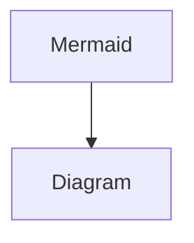

# Projections

TBD - will be tell benefits and usage of spring data projections

When we are using Spring Data JPA, If we want to fetch specific fields of an entity which is contains many relationships and fields we would all get all those unnecessary fields if we get the entity itself by repository method like getEntityById we will get unnecessary fields as well.

It will leads to overhead resource usage in the database and our application because of unused data will load to memory.

:::info
Bu bir **bilgilendirme** kutusu.
:::

Let's say we have an order entities which have products in one to may relationship.

Aşağıda ki gibi iki bir entity class’ımız olduğunu düşünüelim. Order içinde order date ve o order'a ait product'ları alan bir query lazım.

```java
public class Order {
	@ManyToOne()
	private Collection<OrderItem> orderItems;
	private LocalDateTime orderDate;
	private Collection<Product> products;
}
```

```java
@Entity(name="product")
public class Product {
	private Long id;
	@OneToMany(mappedBy= "order")
	private Order order;
	private BigDecimaş price;
	private String productName;
	private ProductType productType;
}
```


